# Exploratory Data Analysis (EDA) of Supply Chain

## Project Overview & Objective
This project conduct a full exploratory data analysis (EDA) to understand data types, distributions, missing values, outliers, and relationships between variables in a supply chain dataset. The EDA will act as a foundation for future objective-specific analyses and projects.

The analysis focuses on supply chain data from a fashion and beauty startup, analyzes the movement and performance of products across different operational stages — from suppliers to customers.

## Data Source
- Dataset Name: Supply Chain Data
- Source: Kaggle
- Data Format: CSV
- Download Link: [*Supply Chain Data (Kaggle)*](https://www.kaggle.com/datasets/harshsingh2209/supply-chain-analysis/data)

    | Variable Name               | Description                                                                 |
    |----------------------------|-----------------------------------------------------------------------------|
    | `Product Type`               | The type of product represented in the supply chain data.                    |
    | `SKU`   | Stock Keeping Unit a unique code used to identify a specific product.                           |
    | `Price`                      | The selling price of the product.                                            |
    | `Availability`               | The current availability of the product (units in stock).                   |
    | `Number of Products Sold`    | The number of units sold during a specific time period.                      |
    | `Revenue Generated`          | The total revenue generated from product sales over a specific period.       |
    | `Customer Demographics`      | Information about customer characteristics, such as age, gender, and location.|
    | `Stock Levels`               | The number of units currently available in stock.                            |
    | `Lead Times`                 | The time required to order or distribution centre receive products from suppliers.               |
    | `Order Quantities`           | The number of units ordered in a single purchase or shipment.                |
    | `Shipping Times`             | The duration required to ship products to customers.                         |
    | `Shipping Carriers`          | The companies or services used to deliver products.                          |
    | `Shipping Costs`             | Costs associated with shipping, including delivery and additional fees.      |
    | `Supplier Name`              | The name of the supplier or vendor providing the products or materials.      |
    | `Location`                   | The physical location of the warehouse or distribution center.               |
    | `Lead Time (Materials)`      | The time required to acquire raw materials from suppliers.                   |
    | `Production Volumes`         | The number of units produced during a specific time period.                  |
    | `Manufacturing Lead Time`    | The time taken to manufacture a product from start to finish.                |
    | `Manufacturing Costs`        | Expenses related to the production process, including materials and labor.   |
    | `Inspection Results`         | Outcomes of product or material quality inspections.                         |
    | `Defect Rates`               | The percentage or rate of defective products produced.                       |
    | `Transportation Modes`       | The mode of transportation used.                      |
    | `Routes`                     | The delivery paths taken to transport products from origin to destination.   |
    | `Costs`                      | Total costs associated with the supply chain, including production and logistics. |

## Workflow Steps
1. Import Libraries & Load Data
2. Initial Data Overview
3. Data Cleaning & Formatting
4. Univariate Analysis
5. Bivariate
6. Multivariate Analysis
7. Outlier Detection
8. Data Quality Summary


## Exploratory Data Analysis (EDA)

### 1. Import Libraries & Load Data

```python
# Importing the necessary libraries for data analysis and visualization.
import pandas as pd
import numpy as np 
import seaborn as sns
import matplotlib.pyplot as plt

# Load the dataset into a DataFrame using 'pandas'.
df = pd.read_csv("supply-chain-analysis/supply_chain_data.csv")
```
---
### 2. Initial Data Overview
Inspect the dataset to understand its structure, data type, and identify any missing values:

```python
# Check the number of rows and columns
df.shape
```

- The dataset contains **100 rows** and **24 columns**

```python
# Preview the top 5 records
df.head()
```
-   The first five rows provide a snapshot of the dataset structure, and all columns appear to be correctly typed.
- Some currency-related data shows more than two decimal places and will be converted for consistency.  

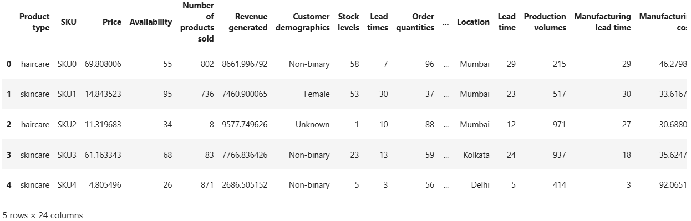

```python
# Check data type and null counts
df.info()
```
-   All data types are appropriate, and the dataset contains no missing values.
- The column names **'Lead times'** (supplier product receipt) and **'Lead Time'** (manufacturer raw materials receipt) may cause confusion.
To improve clarity, both columns will be renamed

    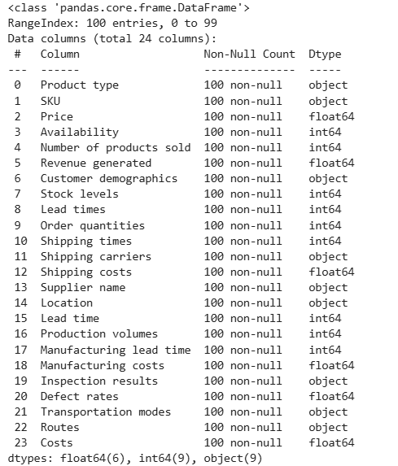 
```python
# Summary of statistics
df.describe()

df.describe(include='object') ## Only categorical columns
```
- The summary describes statistical distribution of 15 numerical columns and 9 categorical columns.
-   All columns contains no missing values, each has a count of 100. The numerical columns contain no negative values.
- The `Revenue generated` column shows a high standard deviation, indicating that some products generate very low sales while others generate very high sales.
- The `Defect rates` column has the lowest standard deviation, suggesting that only a small portion of outputs fail to meet quality standards.
- There are three product types, with **skincare** being the most commonly sold.
- **Road transportation** is the primary mode used to deliver products from factory to distribution center.


    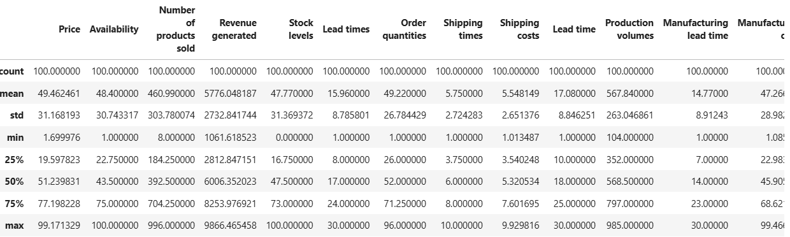

    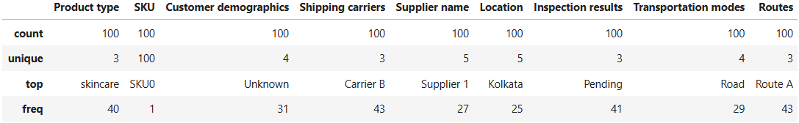

---
### 3. Data Cleaning & Formatting

```python
# Format all floating-point numbers in the table to display with 2 decimal places
pd.set_option('display.float_format', lambda x: '%.2f' % x)

# Rename columns for better clarity and convenience during analysis
df.rename(columns={'Lead times': 'Supplier lead time', 'Lead time': 'Material lead time'}, inplace=True)

# Double-check column renaming and decimal formatting
df.describe()

# Save cleaned data from Python to a CSV
df.to_csv('supplychain_cleaned_data.csv', index=False)
```

Output:

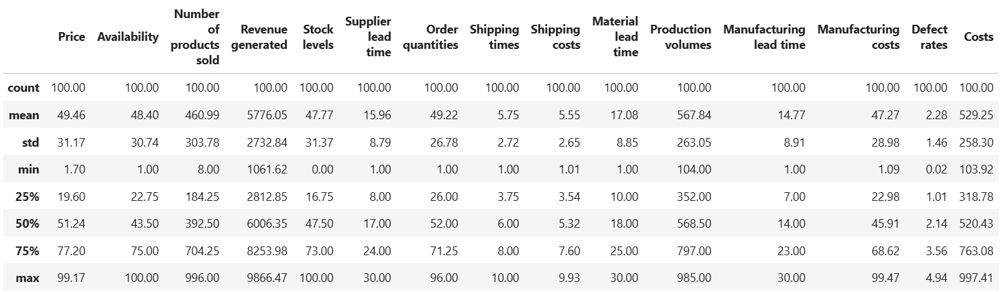

- All floating number display two decimal places for consistency.
- The columns 'Lead times' and 'Lead time' are renamed to `Supplier lead time` and `Material lead time` to avoid confusion.

---
### 4. Univariate Analysis

This section will examine the distribution of individual variables to understand their spread and frequency which helps to identify skewness, outliers and potential data transformation needs.

-   Numeric variables are visualized by histograms and skewness analysis to understand their distribution.
- Categorical variables are visualized by bar charts to determine the most frequent categories.
---
```python
# Histogram and skewness for numerical variable

from scipy.stats import skew

# Calculate skewness of Revenue generated
skew_revenue = skew(df["Revenue generated"])

# Plot distribution with KDE (smoothed line)
plt.figure(figsize=(8, 5))
sns.histplot(df["Revenue generated"], kde=True, bins=20, color='darksalmon')
plt.title(f"Distribution of revenue (Skewness={skew_revenue:.2f})")
plt.xlabel("Revenue Generated")
plt.ylabel("Frequency")
plt.show()

# Print skewness
print(f"Skewness of revenue generated: {skew_revenue:.2f}")
```
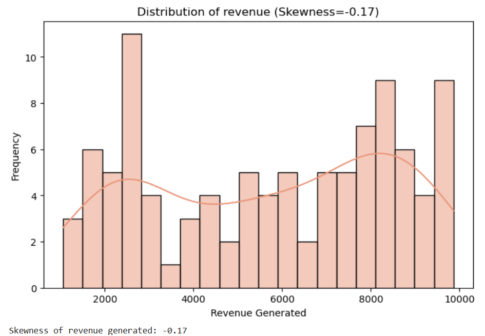
- Based on the distribution of `Revenue Generated`, the data slightly skew to the left since skewness is -0.17 and very close to 0 then it almost normally distributed.
- The histogram shows bimodal distribution with the first peak around 2,500 Rupee and the second peak around 8,000 Rupee
- The `Revenue Generated` data set shows 2 distinct revenue groups where there are low to mid revenue transactions and high value transactions.
---

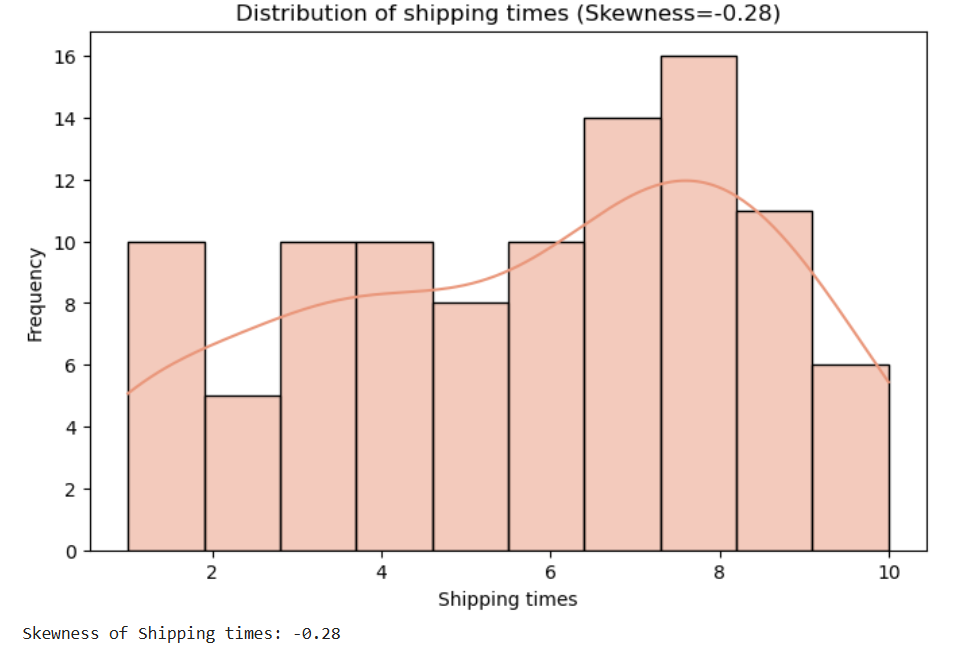
- The distribution of `Shipping Times` is left-skewed with skewness of -0.28 which is close to normal distribution.
- According to the histogram, the most common shipping time from distribution centre to customer is aroud 8 days while the shortest is approxiamately 2 to 4 days.
- Deliveries about 2 to 4 days indicate the shipments to nearby locations and reflect operational efficiency in certain regions.
- Since the most shipping time around 8 days, it considered as slow potentially, lead to customer dissatisfaction. Collecting and analyzing customer feedback can help to identify areas for service improvement.
---
```python
# Bar chart for categorical variable

# Count the frequency of each type in Product Type
count_type = df['Product type'].value_counts().reset_index()

# Rename columns for clarity
count_type.columns = ['Product Type', 'Count']

# Create figure and axes for the chart
fig, ax = plt.subplots(figsize=(8, 5))

# Create a bar chart to show the count of each product type
sns.barplot(
    x=count_type['Product Type'],
    y=count_type['Count'],
    hue=count_type['Product Type'],
    palette="Blues", ax=ax)

# Set labels and title on axes
ax.set_title("Bar Plot of Product Type")
ax.set_xlabel("Product Type") 
ax.set_ylabel("Count")

# Display the plot
plt.show()
```
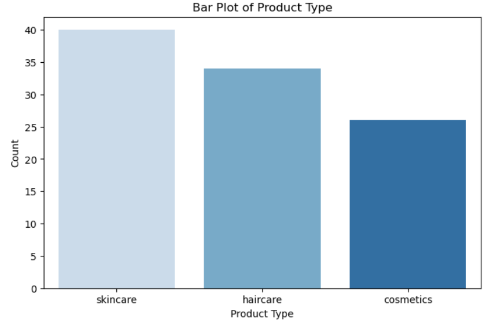

- The company sells three types of products, with skincare having the highest number of SKUs, followed by haircare and cosmetics.
- This suggests skincare is the company's main product focus.

---

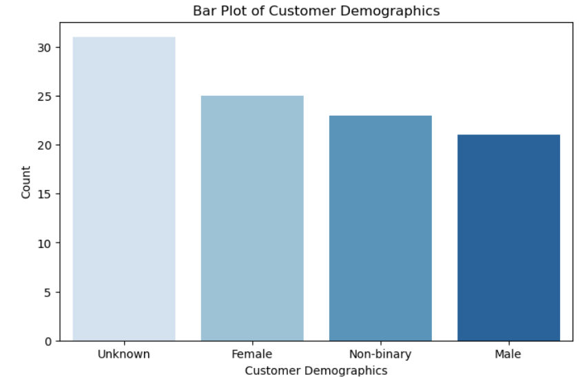

- Based on the bar plot, most SKUs are associated with an unknown customer demographic, followed by female, non-binary, and male customers.
- Products labeled with 'Unknown' in the customer demographics may indicate items that are used by any gender and potentially suitable for all age groups, including children.
---

### 5. Bivariate Analysis

To identify the relationship between two variables, three functions are defined based on the types of variables which are categorical and numerical with continous variables. 

Function are structured as follows: 
 - **Scatter plot**, **Pearson correlation** and **Spearman correlation** determine the relationships between continous numerical variables.
 - The **Chi-Square test** check the relationships between categorical variables.
 - The **ANOVA test** determine relationship between categorical and numerical variables.


```python
# Import library
from scipy.stats import pearsonr, spearmans, chi2_contingency, f_oneway
```

```python
# Bivariate analysis between numerical variables (Correlation & Scatter Plot)
def numerical_bivariate_analysis(df, var1, var2):
    
    # Pearson & Spearman Correlation test
    print(f"Pearson Correlation: {pearsonr(df[var1], df[var2])}")
    print(f"Spearman Correlation: {spearmanr(df[var1], df[var2])}")

    # Scatter plot
    plt.figure(figsize=(8, 5))
    sns.scatterplot(data=df, x=var1, y=var2)
    plt.title(f'Scatter Plot of {var1} vs {var2}')
    plt.show()

# Bivariate analysis between numerical & categorical variable (Boxplot & ANOVA)
def categorical_numerical_analysis(df, cat_var, num_var):
        
    # ANOVA test
    groups = [group[num_var].dropna().values for name,
    group in df.groupby(cat_var)]
    if len(groups) > 1:
        stat, p = f_oneway(*groups)
        anova_text = f'ANOVA: F = {stat:.2f}, p = {p:.4f}'
    else:
        anova_text = 'ANOVA: Not enough groups'

    # Boxplot
    plt.figure(figsize=(15,8))
    sns.boxplot(data=df, x=cat_var, y=num_var)
    plt.title(f'Boxplot of {num_var} by {cat_var}')
    plt.show()

# Bivariate analysis between categorical variables (Heatmap & Chi-square test)
def categorical_bivariate_analysis(df, var1, var2):
    
    #Chi-square test
    contingency_table = pd.crosstab(df[var1], df[var2])
    chi2, p, dof, expected = chi2_contingency(contingency_table)
    print(f"Chi-square Test: Chi2={chi2}, p-value={p}")

    # Heatmap
    plt.figure(figsize=(8, 5))
    sns.heatmap(contingency_table, annot=True, cmap="Blues", fmt='d')
    plt.title(f'Heatmap of {var1} vs {var2}')
    plt.show()
```
---

### `Production volumes` vs `Manufacturing lead time`

```python
numerical_bivariate_analysis(df,'Production volumes','Manufacturing lead time')
```
Output:

 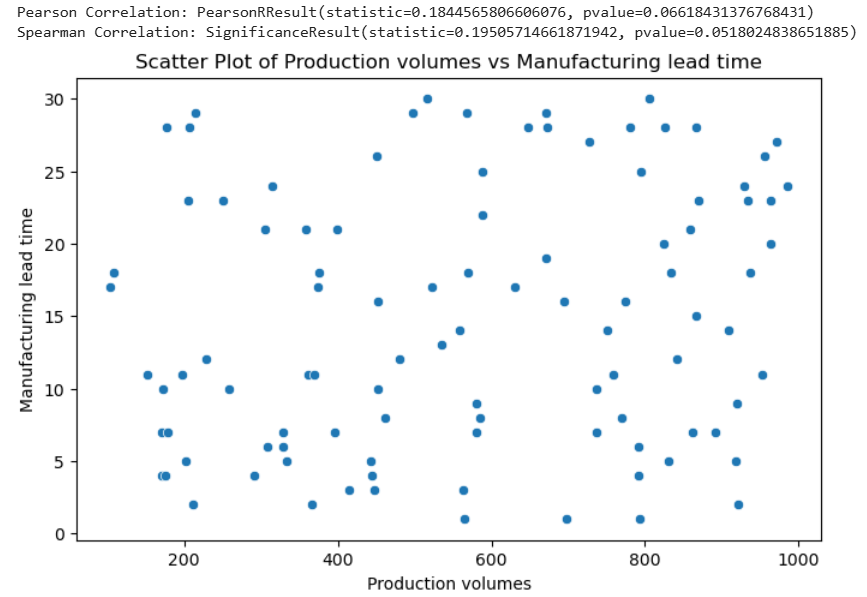

-   Both **Pearson** and **Spearman** correlation analyses and the p-values greater than 0.05, show no statistically significant relationship between the variables. 
- The correlation coefficient are low, and the scatter plot shows no linear or monotonic trend. Therefore, there is no relationship exists between the variables.

Overall, correlation anlysis explores the relationship between all numerical variables using scatter plot, Pearson and Spearman correlation tests.

Across all variables, no statistically significant relationship are found, as the p-values exceeded 0.05. All the numerical variables operate independently. As a result, other analytical methods may be more appropiate for identifying patterns in the data. 

---
### `Shipping carriers`  vs  `Number of product sold`

```python
categorical_numerical_analysis(df,'Shipping carriers','Number of products sold')
```
Output:

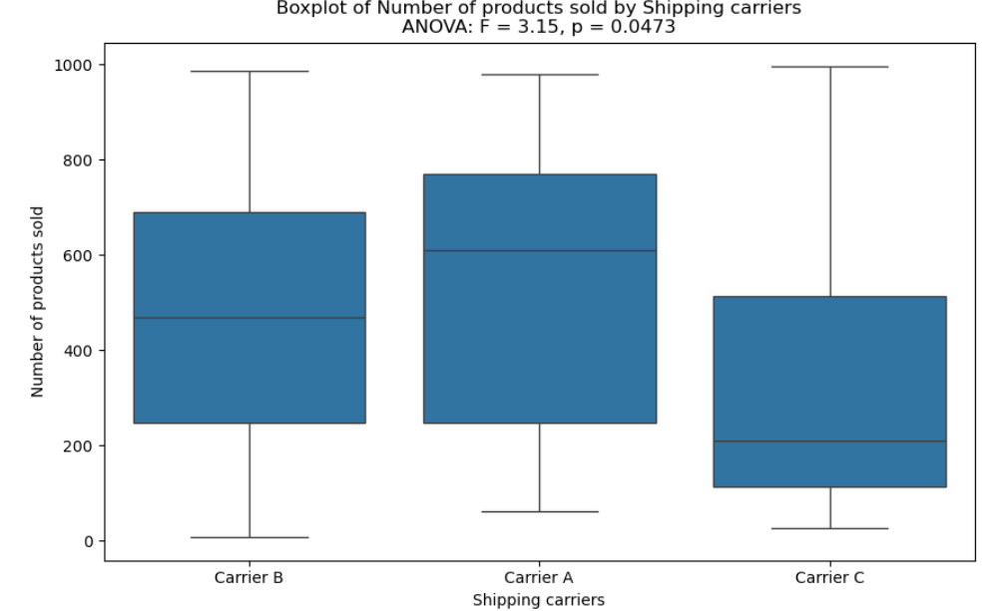

The **ANOVA test** and p-value indicate a statistically significant difference in the number of products sold accross shipping carriers.

-   **Carrier A** shows highest median number of product sold compared to **Carrier B** and **Carrier C**.

-   **Carrier C** has longer upper whisker, indicating greater variability above the median. All shipping carriers have no outliers as the values remain within the ranges.

-   The box for **Carrier** A is wider indicating greater variation (larger interquartile range) in the number of products sold compared to **Carrier B** and **Carrier C**.

This analysis reveals that **Carrier A** consistently manages more varied shipment sizes, while **Carrier C** occasionally handles large shipment sizes. These can guide shipping strategy optimization to align selection of carrier with order size patterns.

---
### `Product type` vs `Customer demographics`

```python
categorical_bivariate_analysis(df,'Product type','Customer demographics')
```
Output:

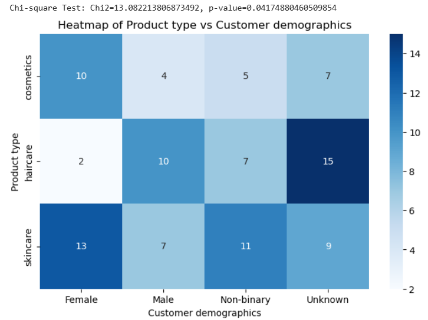

For categorical bivariate analysis, variables are statistically significant where the p-value is less than 0.05.

- Based on the product designed for different customer demographics, the **Unknown** category includes the highest number of  haircare SKUs sold by the company, followed by **Male** and **Non-Binary** categories. **Female** category has the lowest number of haircare SKUs.

- For skincare, the **Female** category  has the highest number of SKUs, followed by **Non-binary**, **Unknown** and **Male** categories. 

- Similar to skincare, the **Female** product category also dominates the number of cosmetics SKUs, followed by the **Unknown** category.

These findings highlight how the company’s product offerings are distribute across customer demographics and support decisions in product development or targeted marketing.

---
### 6. Multivariate Analysis

In this section, a heat map visualizes the correlation and strength of relationships. The gradient colors indicate positive, negative or no correlation which providing an overview of how the variables relate.

```python
sns.heatmap(df.corr(numeric_only=True), annot = True)
plt.rcParams['figure.figsize'] = (20,10)
plt.show()
```


Output:

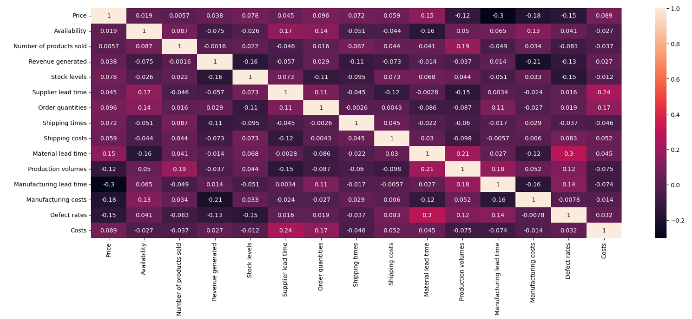


- The correlation matrix shows that all variables have weak linear relationship, where the coefficients between **-0.3** and **+0.3**. This indicates that no strong linear correlation exists among the variables.

Despite the weak linear correlations, the variables remain valuable for EDA to explore distributions, group differences, and potential non-linear patterns.

---
### 7. Outlier detection

The Interquartile Range (IQR) method detects outliers in numerical variables. Data points are labelled as outliers if they fall below **Q1 - 1.5 x IQR** or above **Q3 + 1.5 x IQR**, where **IQR = Q3 - Q1**. This method is simple and fit skewed business data.

The function is defined as below:
```python
def detect_outliers_iqr(df, num_var):
    # Calculate Q1 and Q3
    Q1 = df[num_var].quantile(0.25)
    Q3 = df[num_var].quantile(0.75)
    IQR = Q3 - Q1
    
    # Determine the outlier boundaries
    lower_bound = Q1 - 1.5 * IQR
    upper_bound = Q3 + 1.5 * IQR
    
    # Filter outliers
    outliers = df[(df[num_var] < lower_bound) | (df[num_var] > upper_bound)]
    
    # Print summary
    print(f"Q1: {Q1}, Q3: {Q3}, IQR: {IQR}")
    print(f"Lower Bound: {lower_bound}, Upper Bound: {upper_bound}")
    print(f"Number of outliers in {num_var}: {outliers.shape[0]}")

outliers = detect_outliers_iqr(df,'Supplier lead time')
```
Output:
```
Q1: 8.0, Q3: 24.0, IQR: 16.0
Lower Bound: -16.0, Upper Bound: 48.0
Number of outliers in Supplier lead time: 0
```

-  The `Supplier lead time`  variable is determined for outliers using the IQR method. All data points fall within lower and upper bounds, indicating no outliers in this variable.

Overall, no outliers are detected across all the variables, then no data is removed.


---
### 8. Cleaned data

In this section, data quality summary shows whether any of the variables have missing values, duplicates and outliers.

For outliers, the IQR method is applied in the previous step (Outlier Detection). This section summarizes the outliers detected and actions taken.

```python
# Check missing values
df.isnull().sum()

# Check duplicate rows
df.duplicated().sum()
```

Summary:

| Variable             | % Missing | Duplicates | Outliers | Action Taken       |
| ------------------------- | --------- | ---------- | -------- | ------------------ |
| `Product Type`            | 0%        | 0%         | 0        | No action needed   |
| `SKU`                     | 0%        | 0%         | 0        | No action needed   |
| `Price`                   | 0%        | 0%         | 0        | No action needed |
| `Availability`            | 0%        | 0%         | 0        | No action needed   |
| `Number of products sold` | 0%        | 0%         | 0        | No action needed |
| `Revenue generated`       | 0%        | 0%         | 0        | No action needed |
| `Customer demographics`   | 0%        | 0%         | 0        | No action needed   |
| `Stock levels`            | 0%        | 0%         | 0        | No action needed   |
| `Supplier lead time`      | 0%        | 0%         | 0        | No action needed   |
| `Order quantities`        | 0%        | 0%         | 0        | No action needed |
| `Shipping times`          | 0%        | 0%         | 0        | No action needed |
| `Shipping carriers`       | 0%        | 0%         | 0        | No action needed   |
| `Shipping costs`          | 0%        | 0%         | 0        | No action needed  |
| `Supplier name`           | 0%        | 0%         | 0        | No action needed   |
| `Location`                | 0%        | 0%         | 0        | No action needed   |
| `Material lead time`      | 0%        | 0%         | 0        | No action needed   |
| `Production volumes`      | 0%        | 0%         | 0        | No action needed  |
| `Manufacturing lead time` | 0%        | 0%         | 0        | No action needed   |
| `Manufacturing costs`     | 0%        | 0%         | 0        | No action needed  |
| `Inspection results`      | 0%        | 0%         | 0        | No action needed   |
| `Defect rates`            | 0%        | 0%         | 0        | No action needed  |
| `Transportation modes`    | 0%        | 0%         | 0        | No action needed   |
| `Routes`                  | 0%        | 0%         | 0        | No action needed   |
| `Costs`                   | 0%        | 0%         | 0        | No action needed |


The data quality check found no missing values, duplicates, or outliers across all variables. Therefore, no data cleaning action was required.

Here the download link for cleaned data: [*Supply Chain Cleaned Data*](https://github.com/azerinnan/draft_EDA_supplychain/blob/main/supplychain_cleaned_data.csv)

---

## Conclusion

- **Skincare** is the product type with the highest number of SKUs sold by the company.
- All numeric data is formated to two decimal places for consistency, and columns are rename to `Supplier lead time` and `Material lead time`.
- The distribution of `Shipping time` is skewed to the left, indicating most shipment take  around 8 days.
- The **Unknown** customer demographic has the highest SKUs. 
- Bivariate analysis shows a significant relationship between `Product type` vs `Customer demographics`, but no significant correlation found between numerical variables.
- Outlier detection using IQR method finds no outlier, no missing values and no duplicate row are detected.

EDA provides a comprehensive understanding of the data set and identify relationship between variables. Outlier detection and data quality check confirm that the data is clean and suitable for further analysis, and ready for deeper business insights.
